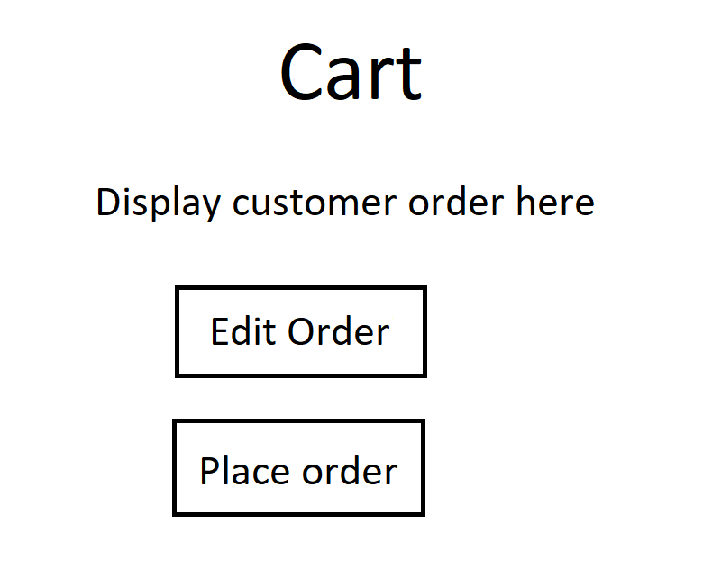

# Design Documention

## *Juicy Burger Online Ordering Portal* 

## 1. Problem Statement

[comment]: <> (*Explain clearly what problem you are trying to solve.*)
The client, Juicy Burgers, have been serving their community for years as a simple walk in service. With the
shifting technological landscape, Juicy Burger desires to modernize their business with an online ordering
service with the goal of streamlining the ordering experience while increasing their online presence.

The goal is to reduce over crowding during peak operating hours that may hamper potential customers from accessing 
Juicy Burgers products as well as increasing the number of potential customers in general.

## 2. Top Questions to Resolve in Review

1. Is the shopping cart handled by the Front End or the Back End?  
2. Will the menu initially be hard coded on the Front End or a call to the database?
3. How detailed should the data models be? How many data models do we need?
4. How many data tables do we need?

## 3. Use Cases

U1. *As a Juciy Burger customer, I want to be able to view the menu when I go to the website*

U2. *As a Juicy Burger customer, I want to be able to add, update, and delete menu items in my shopping cart*
    
U3. *As a Juicy Burger customer, I want to be able to place an order*

U4. *As a Juicy Burger customer, I want to be able to view a previously placed order*

## 4. Project Scope

### 4.1. In Scope
- View the Juicy Burger menu
- Add menu items to a shopping cart
- Update items in a shopping cart
- Delete items from a shopping cart
- Place an Order
- Retrieve an Order

### 4.2. Out of Scope
- Substitutions on menu items
- Creating a user account
- Delivery service
- End points for Business integration at physical location

# 5. Proposed Architecture Overview
1) Viewing the menu items
   - The front end Javascript will make a get call to a .json file that will populate and display the menu 
   to the customer.
2) Adding menu items to a shopping cart 
   - The front end will build an order with menu items, and display the order to the customer as a shopping cart.
3) Updating items within a shopping cart
   - The frontend will have functionality to update the order, either by quantity or by menu item.
4) Deleting items from a shopping cart
   - The frontend will have functionality to delete items within a shopping cart.
5) Placing an order with a shopping cart
   - The front end generates a PlaceOrderRequest for the backend, where an Order is generated within a Lambda 
   function. The Order is stored within a dedicated Order table in DynamoDB, and a copy of the Order is returned 
   to the customer.

This model represents a simple but complete solution for every use case we proposed. Each function is constrained 
to a specific task, and there are no overlapping functions.

# 6. API

## 6.1. Public Models

OrderModel

MenuItemModel

## 6.2.1. *Place Order Activity*

*Describe the behavior of the first endpoint you will build into your service
API. This should include what data it requires, what data it returns, and how it
will handle any known failure cases. You should also include a sequence diagram
showing how a user interaction goes from user to website to service to database,
and back. This first endpoint can serve as a template for subsequent endpoints.
(If there is a significant difference on a subsequent endpoint, review that with
your team before building it!)*

The customer places an order. The Javascript creates an Order object with the MenuItems the customer selected and 

sends it to the backend, where the lambda function checks for invalid order attributes. It returns if the order is 

invalid, else it sends the Order to the database. The database sens back the Order data, which is displayed

to the customer.

*(You should have a separate section for each of the endpoints you are expecting
to build...)*

## 6.2.2 *Get Order Activity*

*(repeat, but you can use shorthand here, indicating what is different, likely
primarily the data in/out and error conditions. If the sequence diagram is
nearly identical, you can say in a few words how it is the same/different from
the first endpoint)*

The same path is used that was used for Place Order Activity, and the same thing is returned. The database checks for 

a valid orderId (which is returned to the customer as an attribute of the Order when the Order is placed) and returns 

an invalid order notification if the orderId is invalid. Else it returns the Order information.

# 7. Tables

(out of scope) MenuTable - holds menu items

OrderHistoryTable - holds previously placed Orders

# 8. Pages

When the customer presses the "Order" button, they are sent to the Menu page, where the 
MenuItems are displayed for them. They then chose which items to include in their order
by selecting the boxes next to the menu item names displayed on the page. When the customer
presses the "Add to cart" button, an Order is built and stored in local memory on thier
machine. When a customer presses the "Edit Order" button, they are sent back to the Menu, 
where they can select a different assortment of items. On the Cart page, when a customer
presses the "Place order" button, the Order is sent to the backend, where it is processed
and stored to the Order History table in the DynamoDB.

